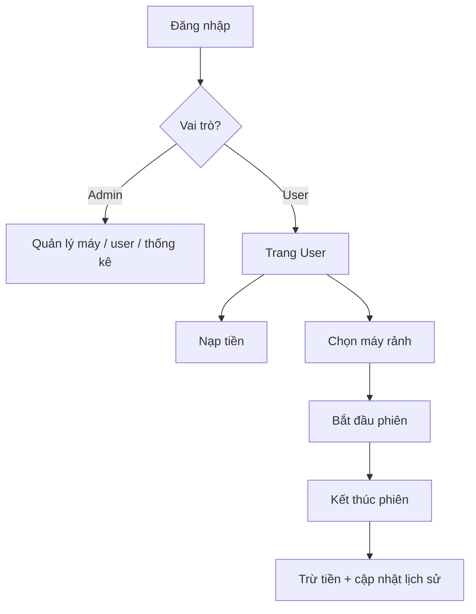

# Quản Lý Quán Net

Ứng dụng web quản lý quán internet (quán net) xây dựng bằng **ASP.NET MVC 5** và **MySQL**. Hệ thống hỗ trợ hai vai trò **Admin** và **User**: khách hàng đăng ký, nạp tiền, chọn máy và thanh toán theo thời gian sử dụng; quản trị viên quản lý máy, người dùng và xem thống kê doanh thu.

## Tính năng

### Người dùng (User)

- Đăng ký tài khoản mới (số điện thoại làm tên đăng nhập)
- Đăng nhập / đăng xuất
- Xem số dư tài khoản
- Nạp tiền vào ví (ghi lịch sử nạp)
- Chọn máy đang **Rảnh** để bắt đầu phiên chơi
- Kết thúc phiên — hệ thống tính phí theo thời gian và trừ vào số dư
- Xem lịch sử sử dụng máy

### Quản trị viên (Admin)

- Quản lý danh sách máy tính (thêm, sửa, xóa, đơn giá, trạng thái)
- Quản lý người dùng (xem, sửa thông tin, xóa)
- Thống kê doanh thu theo ngày: tổng nạp, tổng chi (sử dụng máy), lợi nhuận

## Công nghệ sử dụng

| Thành phần | Phiên bản / Ghi chú |
|------------|---------------------|
| .NET Framework | 4.7.2 |
| ASP.NET MVC | 5.3 |
| Cơ sở dữ liệu | MySQL |
| Truy cập DB | MySqlConnector 2.4 |
| Giao diện | Bootstrap 5, jQuery 3.7 |
| IDE đề xuất | Visual Studio 2019 trở lên |

## Cấu trúc thư mục

```
QuanLyQuanNet/
├── QuanLyQuanNet.sln          # Solution Visual Studio
├── QuanLyQuanNet/
│   ├── Controllers/           # Logic xử lý request
│   ├── Models/                # Model dữ liệu
│   ├── Views/                 # Giao diện Razor (.cshtml)
│   ├── DAL/
│   │   └── DbConnection.cs    # Kết nối MySQL
│   ├── App_Start/             # Route, Bundle
│   ├── Content/               # CSS (Bootstrap, Site.css)
│   ├── Scripts/               # JavaScript
│   ├── Web.config             # Connection string & cấu hình
│   └── Dockerfile             # Container Windows (tùy chọn)
└── packages/                  # NuGet packages
```

### Controllers chính

| Controller | Mô tả |
|------------|--------|
| `NguoiDungController` | Đăng nhập, đăng ký, đăng xuất |
| `UserController` | Trang chủ khách — danh sách máy rảnh, số dư |
| `SuDungMayController` | Bắt đầu / kết thúc phiên sử dụng máy |
| `NapTienController` | Nạp tiền vào tài khoản |
| `LichSuSuDungController` | Lịch sử sử dụng của user |
| `AdminController` | Trang điều hướng Admin |
| `MayController` | CRUD máy tính (Admin) |
| `AdminNguoiDungController` | Quản lý người dùng (Admin) |
| `ThongKeController` | Thống kê doanh thu theo ngày |

## Yêu cầu hệ thống

- Windows với **.NET Framework 4.7.2** trở lên
- **Visual Studio** (khuyến nghị bản có workload *ASP.NET and web development*)
- **MySQL Server** 5.7+ hoặc 8.x
- **IIS Express** (đi kèm Visual Studio) hoặc IIS

## Cài đặt

### 1. Clone hoặc tải mã nguồn

```bash
git clone https://github.com/quoc2075/System-cyber-gaming.git
cd System-cyber-gaming
```

### 2. Tạo cơ sở dữ liệu MySQL

Tạo database tên `quanlyquannet` (hoặc tên khác, nhớ cập nhật `Web.config`):

```sql
CREATE DATABASE quanlyquannet CHARACTER SET utf8mb4 COLLATE utf8mb4_unicode_ci;
USE quanlyquannet;

CREATE TABLE NguoiDung (
    MaNguoiDung INT AUTO_INCREMENT PRIMARY KEY,
    HoTen VARCHAR(100) NOT NULL,
    MatKhau VARCHAR(255) NOT NULL,
    SoDienThoai VARCHAR(20) NOT NULL UNIQUE,
    SoDu DOUBLE DEFAULT 0,
    VaiTro VARCHAR(20) DEFAULT 'User'
);

CREATE TABLE MayTinh (
    MaMay INT AUTO_INCREMENT PRIMARY KEY,
    TenMay VARCHAR(50) NOT NULL,
    TrangThai VARCHAR(30) DEFAULT 'Rảnh',
    DonGia DOUBLE NOT NULL
);

CREATE TABLE LichSuSuDung (
    ID INT AUTO_INCREMENT PRIMARY KEY,
    MaNguoiDung INT NOT NULL,
    MaMay INT NOT NULL,
    ThoiGianBatDau DATETIME NOT NULL,
    ThoiGianKetThuc DATETIME NULL,
    TongTien DOUBLE NULL,
    FOREIGN KEY (MaNguoiDung) REFERENCES NguoiDung(MaNguoiDung),
    FOREIGN KEY (MaMay) REFERENCES MayTinh(MaMay)
);

CREATE TABLE LichSuNapTien (
    MaNap INT AUTO_INCREMENT PRIMARY KEY,
    MaNguoiDung INT NOT NULL,
    SoTien DOUBLE NOT NULL,
    ThoiGian DATETIME NOT NULL,
    FOREIGN KEY (MaNguoiDung) REFERENCES NguoiDung(MaNguoiDung)
);

-- Tài khoản Admin mẫu (đổi mật khẩu sau khi triển khai)
INSERT INTO NguoiDung (HoTen, MatKhau, SoDienThoai, SoDu, VaiTro)
VALUES ('Quản trị viên', 'admin123', '0900000000', 0, 'Admin');

-- Máy mẫu
INSERT INTO MayTinh (TenMay, TrangThai, DonGia) VALUES
('Máy 01', 'Rảnh', 10000),
('Máy 02', 'Rảnh', 12000),
('Máy 03', 'Rảnh', 15000);
```

> **Lưu ý:** Mật khẩu đang lưu dạng plain text. Nên bổ sung mã hóa (bcrypt, PBKDF2, …) trước khi dùng production.

### 3. Cấu hình connection string

Mở `QuanLyQuanNet/Web.config` và chỉnh `connectionStrings`:

```xml
<connectionStrings>
  <add name="MySqlConnection"
       connectionString="server=localhost;user id=root;password=YOUR_PASSWORD;database=quanlyquannet"
       providerName="MySql.Data.MySqlClient" />
</connectionStrings>
```

Thay `YOUR_PASSWORD` bằng mật khẩu MySQL của bạn. Không commit mật khẩu thật lên Git.

### 4. Restore NuGet packages

Trong Visual Studio: chuột phải solution → **Restore NuGet Packages**.

Hoặc dùng Package Manager Console:

```powershell
Update-Package -reinstall
```

### 5. Chạy ứng dụng

1. Mở `QuanLyQuanNet.sln` bằng Visual Studio.
2. Đặt project `QuanLyQuanNet` làm **Startup Project**.
3. Nhấn **F5** (Debug) hoặc **Ctrl+F5** (không debug).

Trang mặc định: `/NguoiDung/Login` (cấu hình trong `App_Start/RouteConfig.cs`).

## Cách tính phí sử dụng máy

Khi user kết thúc phiên (`SuDungMay/KetThuc`):

```
Thời gian (phút) = ThoiGianKetThuc - ThoiGianBatDau
Tiền = DonGia × (số phút / 60), làm tròn số nguyên
```

Số tiền được trừ khỏi `NguoiDung.SoDu` và ghi vào `LichSuSuDung.TongTien`. Máy chuyển trạng thái về **Rảnh**.

## Phân quyền

| Vai trò | Giá trị `VaiTro` | Sau đăng nhập |
|---------|------------------|---------------|
| Admin | `Admin` | `/Admin/Index` |
| User | `User` | `/User/Index` |

Các action Admin kiểm tra `Session["VaiTro"] == "Admin"`. User chỉ truy cập được các chức năng của mình khi đã đăng nhập (`Session["MaNguoiDung"]`).

## Docker (tùy chọn)

Project có `Dockerfile` dùng image **Windows Server** (`mcr.microsoft.com/dotnet/framework/aspnet:4.8-windowsservercore-ltsc2019`). Chỉ chạy được trên Docker với chế độ **Windows containers** và cần publish project trước khi build image.

```powershell
# Publish từ Visual Studio hoặc MSBuild, sau đó build image
docker build -t quanlyquannet ./QuanLyQuanNet
```

MySQL thường chạy riêng (host hoặc container Linux); cập nhật connection string trỏ tới host MySQL tương ứng.

## Luồng sử dụng cơ bản



## Xử lý sự cố thường gặp

| Vấn đề | Gợi ý |
|--------|--------|
| Không kết nối được MySQL | Kiểm tra MySQL đang chạy, user/password, tên database trong `Web.config` |
| Lỗi NuGet / thiếu assembly | Restore packages; đảm bảo thư mục `packages/` tồn tại |
| Đăng nhập Admin không được | Kiểm tra bản ghi có `VaiTro = 'Admin'` trong bảng `NguoiDung` |
| Không thấy máy rảnh | Máy phải có `TrangThai = 'Rảnh'` và user cần có `SoDu > 0` |

## License

Dự án học tập / nội bộ — chưa khai báo license cụ thể. Liên hệ tác giả nếu bạn muốn sử dụng hoặc phân phối lại.
